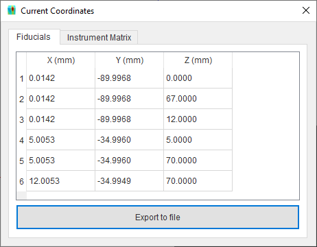
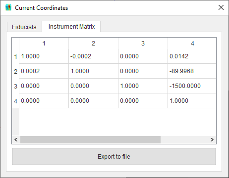
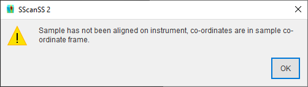

######################
Insert Fiducial Points
######################
Fiducial points are used in SScanSS to determine the position and orientation of a sample after it has been moved to
instrument. The fiducial points will be rendered
as spheres in the graphics window.

*********************************
Loading fiducial points from file
*********************************
To import a :ref:`fiducial file`, Go to **Insert > Fiducial Points > File...**,  browse to the location of the file and
select it.

.. note::
    Imported points will not replace existing points but will be appended to them. Delete old points from
    point manager if necessary.

**********************
Key-in fiducial points
**********************
Click **Insert > Fiducial Points > Key-In** and  type in the X, Y, and Z values of the fiducial points and click **Add Fiducial Point**
button. The fiducial point should be displayed in the graphics window

.. image:: images/add_fiducials.png
   :scale: 80
   :alt: Key-in Fiducials Window
   :align: center

.. _manage fiducial:

**********************
Manage fiducial points
**********************
Fiducial points can be viewed and managed via the point manager. The point manager will be opened when fiducial points are
added, if the point manager is closed it can be opened by selecting **View > Other Windows > Fiducial Points** in the menu.
Points can be edited, re-ordered, deleted, enabled or disabled from the manager, and these operation can be undone (Ctrl+Z)
if needed. The point manager displays the X, Y, Z coordinate of the point and the enabled status in a table. Selecting a
point from the manager will cause the corresponding 3D model to be highlighted in the graphics window, this can be useful
when attempting to identify specific points.

.. image:: images/point_manager.png
   :scale: 80
   :alt: Point Manager Window
   :align: center

Edit fiducial points
====================
Double click a table cell, type in the new value and press the **Enter** key to accept the change.

Re-order measurement points
===========================
Select a row and move the row by clicking the |up| and |down| buttons.

Delete measurement  points
==========================
Select one or more rows and click the |delete| button. Multiple rows can be selected using **Shift + Left Mouse Click** or
**Ctrl + Left Mouse Click**.

Enable/Disable fiducial points
==============================
Click the check box in the fourth column of the desired point to enable or disable it. Click the check box in the fourth
column header to enable or disable all points.

**********************
Export fiducial points
**********************
The fiducial points can be exported from project file to a :ref:`fiducial file`. Click
**File > Export... > Fiducial Points** in the main menu, navigate to the desired save location in the file dialog,
enter a name for the file and press the **Save** button.

.. |up| image:: images/arrow-up.png
            :scale: 10

.. |down| image:: images/arrow-down.png
            :scale: 10

.. |delete| image:: images/cross.png
            :scale: 10

*********************************************
View fiducial coordinates in instrument frame
*********************************************
The fiducial point coordinates can be viewed in the instrument frame by clicking the **Current fiducial coordinates**
icon in the toolbar. This shows a dialog with the fiducial coordinates a separate tab shows the current instrument transformation matrix.

|fiducials| or |matrix|

If the sample is not aligned on the instrument then the fiducials will be displayed in their original coordinate
frame and a warning will be displayed.

