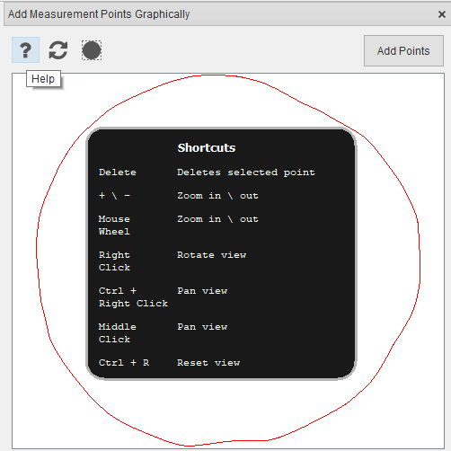
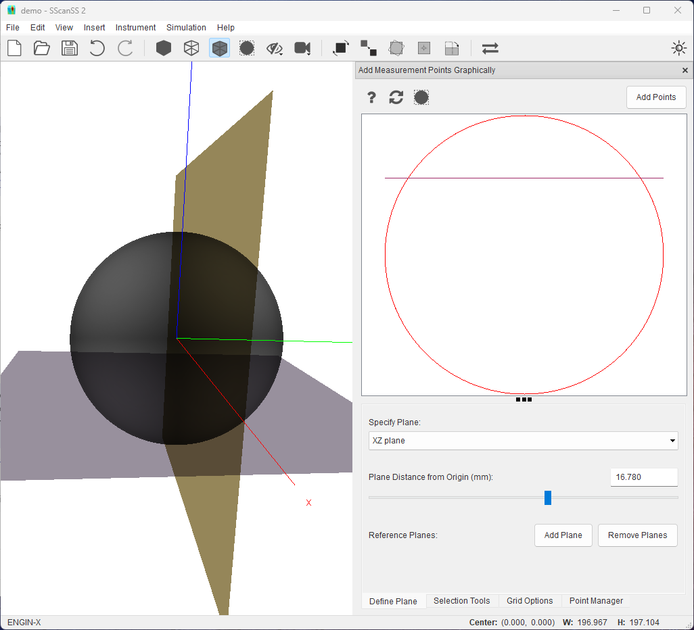
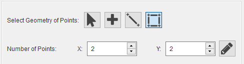

#########################
Insert Measurement Points
#########################
Measurement points may be imported from a file, typed in, or selected graphically. The measurement points are
rendered as stars in the graphics window.

************************************
Loading measurement points from file
************************************
To import a :ref:`measurement file`, Go to **Insert > Measurement Points > File...**, browse to the location of the file and
select it.

*************************
Key-in measurement points
*************************
Click **Insert > Measurement Points > Key-In** and  type in the X, Y, and Z values of the measurement points and click **Add Fiducial Point**
button. The measurement point should be displayed in the graphics window

.. image:: images/add_measurements.png
   :scale: 80
   :alt: Key-in Fiducials Window
   :align: center

****************************************
Graphical selection of measurement point
****************************************
The graphical selection window can be used to select measurement points on a cross-section of the sample. To
graphically add measurement points, click **Insert > Measurement Points > Graphical Selection**. The graphical selection
window consists of two sections: a graphics view (top) and a control panel (bottom) which contains a few tabs. The
cross-sectional plane is shown in the 3D graphics window when the graphical selection window is opened and removed when
the window is closed.

.. image:: images/point_from_graphics.png
   :scale: 50
   :alt: Graphical selection window
   :align: center

Graphics view
=============
The 2D path (for mesh sample) or slice (for volume sample) from the cross-section of a plane with the sample is shown
in the graphic view. Measurement points on the cross-section plane will be also be shown. Above the graphics view is a
tool bar with a few buttons:

* The **Add Points** button inserts points that have been placed in the graphics view into the project.
* The |reset| button resets the graphic view's camera.
* The |help| button shows useful interaction shortcuts for the graphics view.
* The |bound| button draws the bounding box of the sample (bounds and centre)  in the graphics view.

The following interactions are possible on the graphics view

========================   ======================
Shortcut                   Action
========================   ======================
Right Mouse Click          Rotate View
Ctrl + Right Mouse Click   Pan or Move View
Middle Mouse Click         Pan or Move View
Mouse Scroll Wheel         Zoom in or out View
\+ / -                      Zoom in or out View
Delete                     Delete selected points
Ctrl + R                   Reset View
========================   ======================

The following information are displayed in the status bar of the main window:

* The X, Y, Z position of the mouse cursor is shown in real-time as the mouse moves in the view.
* The dimension of the bounding box of the sample cross-section i.e centre, width and height.

Plane definition
================
The **Define Plane** tab provides options to change the orientation and position of the cross-sectional plane. It is
also possible to define a fixed reference plane to mark out-of-plane features if needed.

.. image:: images/graphics_plane.png
   :scale: 80
   :alt: plane definition
   :align: center

* The orientation of the plane can be adjusted by changing the plane normal from the specify plane dropdown. The plane
  normal could be a predefined axis-aligned normal or a custom normal. Selecting **Custom Normal** from dropdown reveals
  input boxes for the X, Y, Z values of the normal.

.. image:: images/graphics_plane_custom.png
   :scale: 80
   :alt: custom plane
   :align: center

* The position of the plane along the normal can be adjusted using the provided slider or textbox. Imprecise movement
  can be done with the slider and precise adjustment can be made with the textbox. The cross section in the graphics
  view is updated as soon as slider is released. Also with the textbox the plane is moved in real-time and the cross
  section is updated as soon as the Enter key is pressed.

.. tip::
   Unsaved points inserted into the graphics view will be removed when the plane is changed. Click the **Add Points**
   button to insert the points into the project before changing the plane.

* A fixed reference plane can be used to mark a line of interest in the cross-section. To add reference plane, move
  the cross-sectional plane to a desired location using the slider or textbox then click the **Add Plane** button,
  a fixed plane will be added in the same location as the cross-section, the cross-section plane can  then be adjusted
  to add more reference planes or to add measurement points. The line of intersection between the  reference plane(s)
  and cross-section plane will be drawn along with the sample. All reference planes can be removed by clicking the
  **Remove Planes** button.

Point selection
===============
The **Selection Tools** tab contains four point selection buttons. The active tool changes the behaviour of the Left
Mouse Click but the zoom, pan and rotate shortcuts continue to work irrespective of the active tool.

* The point tool |point| allows a single point to be selected by clicking on the graphics view.
* The line tool |line| inserts evenly spaced points between a start and end position on a line. Clicking the tool
  reveals an input box in which the number of points required can be specified. When active, a line can be drawn by
  clicking and dragging from a start to end position in the graphics view and on completion the line is immediately
  replaced with the required points. The start and end positions are always included in the generated point set.

* The area tool |area| inserts evenly spaced points along the x and y axis of a rectangle defined by the start
  and end position on the graphics view. Clicking the tool reveals two input boxes in which the number of points
  required in the x and y directions can be specified. When active, as with the line tool, the rectangle an be
  drawn by clicking and dragging from a start to end position in the graphics view and on completion the
  rectangle is instantly replaced with the required points.

* The select tool |select| allows selection of individual points in the graphics view or multiple points using
  CTRL + Left Click or by dragging with the Left Mouse. The selected points can moved by dragging or deleted by
  pressing the delete key.

.. note::
    Measurement points that have been added to the project cannot be moved or deleted in the graphics view, these
    points are fixed and would have a different colour (red) from the non-fixed point (black). The fixed points can be
    adjusted from the point manager, hovering the mouse over a fixed point will show the point's index in a tooltip.

The line and area tool also have a edit |edit| button that allow the x and y components of start and end position to
be typed-in. Clicking the |edit| button will reveal 4 input boxes and two buttons (accept and cancel), changing the
value in the input boxes should draw the appropriate shape (line or rectangle) in the graphics view, then clicking the
accept button (tick mark) will generate the points from the shape while the cancel button will remove the shape. When
the |edit| mode is active, the ability to select points by dragging the mouse will be disabled and also snap selection
to grid will not work.

Grid options
============
The **Grid option** tab has three options. The **Show Grid** option overlays a grid on the graphics view to help with
precision point selection, **Snap Selection to Grid** option snaps the selected points to the closest grid intersection,
and **Snap Cross-Section to Grid** option snaps an anchor point on the cross-section to the grid.

.. image:: images/graphics_grid.png
   :scale: 50
   :alt: grid options
   :align: center

* When the show grid option is selected, input boxes for grid type and size are revealed. The grid can be either a
  Box (rectangular) or Polar type. The Box grid requires size in mm for the X and Y axis of the grid while the Polar
  grid requires radius in mm and angle in degrees. The grid remains fixed when the cross-section is rotated or panned
  but will zoom with cross-section to maintain scale.
* The snap selection to grid option is only enabled when the show grid option is selected. When snap selection to grid
  option is selected, the selected points are placed at the nearest grid intersection.

.. note::
    For line and area selection tools, only the start and end positions will be snapped to the grid, and the other
    points will be generated in between the new start and stop positions.

* The snap cross-section to grid option is only enabled when the show grid option is selected. When snap cross-section
  to grid option is selected, panning in the graphics view will move the anchor point (blue rectangle) to the nearest
  grid intersection in the direction of the mouse movement. A different anchor point can be selected from the
  **Snap Anchor** dropdown.

.. note::
    For the polar grid, the anchor will snap along the radial direction. Hold the shift button when panning to
    snap in the angular direction (**Shift + Ctrl + Right Mouse Click** or **Shift + Middle Mouse Click** )

Point manager
=============
The **Point Manager** tab shows all measurement points added to the project. It allows us to reorder, delete, edit, and
disable measurement points.

.. image:: images/graphics_point_mgr.png
   :scale: 80
   :alt: point manager
   :align: center

*************************
Manage measurement points
*************************
Measurement points can be viewed and managed via the point manager. The point manager will be opened when measurement
points are added (for graphical selection use the **Point Manager** tab), if the point manager is closed it can be
opened by selecting **View > Other Windows > Measurement Points** in the menu. Operations for measurement points are
similar to :ref:`manage fiducial`.

*************************
Export measurement points
*************************
The measurement points can be exported from project file to a :ref:`measurement file`. Click
**File > Export... > Measurement Points** in the main menu, navigate to the desired save location in the file dialog,
enter a name for the file and press the **Save** button.

.. |point| image:: images/point.png
            :scale: 10

.. |line| image:: images/line_tool.png
            :scale: 10

.. |area| image:: images/area_tool.png
            :scale: 10

.. |select| image:: images/select.png
            :scale: 10

.. |reset| image:: images/refresh.png
            :scale: 10

.. |help| image:: images/question.png
            :scale: 10

.. |bound| image:: images/boundingbox.png
            :scale: 10

