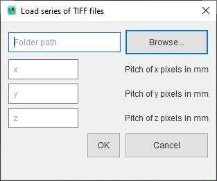

########################
Insert Tomography Volume
########################
Tomography volumes may be added from Nexus files (HDF5 files conforming to the |NXtomoproc| standard), or from a number of .TIFF files. Both options are detailed below

*************************************
Import a Tomography Volume from Nexus
*************************************
The Nexus file must conform to the Nexus standard |NXtomoproc|, containing at the very least:

- NXentry = NXtomoproc
- tomography data
- array for each of x, y, and z axis data

Click **Insert > Sample > Tomography Data > Nexus File** and browse to the location of the Nexus file and select it. The tomography volume will be loaded into memory.

.. tip::
   The file suffix can be any of .nxs, .h5, or .nex however it must conform to the standard to be loaded

******************************************
Import a Tomography Volume from TIFF Files
******************************************
The TIFF files can be .TIFF or .TIF and should be named with an appropriate numbering system to load them in the correct order.
Click **Insert > Sample > Tomography Data > TIFF Files** and browse to the folder containing the TIFF files and select it.
In addition, the pitch of every axis needs to be defined manually, this corresponds to the physical size in space of a single pixel/voxel side in mm.
The tomography volume will be loaded into memory.

.. |NXtomoproc| raw:: html

   <a href="https://manual.nexusformat.org/classes/applications/NXtomoproc.html" target="_blank">NXtomoproc</a>
