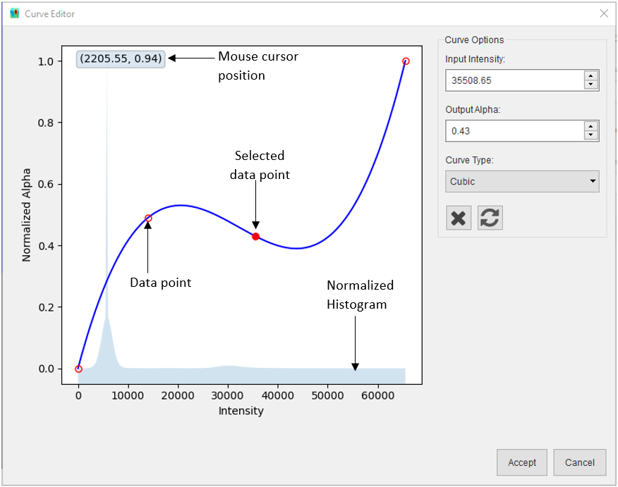
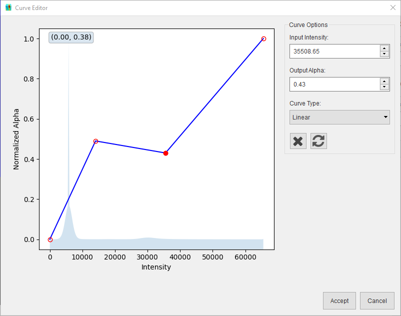

#############
Insert Volume
#############
Volumes may be added from Nexus files (HDF5 files conforming to the |NXtomoproc| standard), or from a stack
of TIFF files. Both options are detailed below

**************************
Import a Volume from Nexus
**************************
The Nexus file must conform to the Nexus standard |NXtomoproc|. Click **Insert > Sample > Volume > Nexus File...** and
browse to the location of the Nexus file and select it. The volume will be loaded into memory.

.. note::
   The file extension should be .nxs, or .nex however the file structure must conform to the standard to be loaded

*******************************
Import a Volume from TIFF Files
*******************************
The TIFF files should have the .TIFF or .TIF extension and should be named with a sequential numbering system to ensure
the files are loaded in the correct order. To load the volume, Click **Insert > Sample > Volume > TIFF Files...** and
in the **Load Volume** dialog, select the folder containing the TIFF files, then specify the voxel size and the
coordinates of the volume centre. Click the **Load Volume** button and the volume will be loaded into memory.

.. image:: images/volume_loader.png
   :scale: 80
   :alt: Load volume dialog
   :align: center

**********************
Using the Curve Editor
**********************
The curve editor can be used to change the alpha values used to render the different intensity values in the volume.
After a volume is loaded, the curve editor can be opened by clicking the |curve| button in the toolbar. The curve editor
dialog consists of two sections: a plot widget (left) and curve options (right):

The plot widget shows a normalized histogram (i.e. values scaled between 0 and 1) of the volume in the background. The
curve used to generate the alpha values for the volume is drawn in the foreground with the intensity values in the X axis
and normalized alpha values in the Y axis. The data points used to generate the curve are represented with red circle
outline markers and the selected marker is a red filled circle marker. A data point can be added to the curve by left
clicking in the desired XY location, the curve will be redrawn to include the new data point and that point becomes the
selected data point, this can be changed by left clicking on another marker. A data point's position can be adjusted by
left clicking on its marker and dragging the marker to a new location, dragging the selected marker over another
marker will merge that marker to the selected one. The curve will also be redrawn in real-time to reflect the adjusted
marker position. The volume in the 3D scene will also be redrawn when the mouse button is released to show a preview of
the alpha values generated with the curve. The following can be performed via the curve options:

* The selected data point (filled red marker) can also be adjusted by typing in the required the **Input intensity**
  and/or **Output alpha**.
* The curve type can be changed from **Cubic** to **Linear** or vice versa via the dropdown.

* The selected data point can be deleted by clicking the |cross| button.
* The curve can be reset to the initial curve by clicking the |reset| button.

After modifying the curve, the new curve can be saved by clicking the **Accept** button or rejected by clicking the
**Cancel** button.

.. |cross| image:: images/cross.png
            :scale: 10

.. |reset| image:: images/refresh.png
            :scale: 10

.. |NXtomoproc| raw:: html

   <a href="https://manual.nexusformat.org/classes/applications/NXtomoproc.html" target="_blank">NXtomoproc</a>