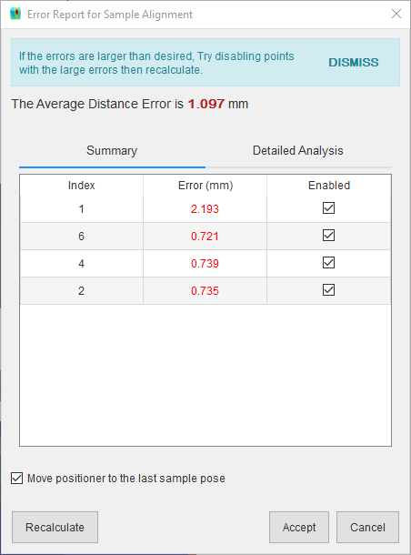
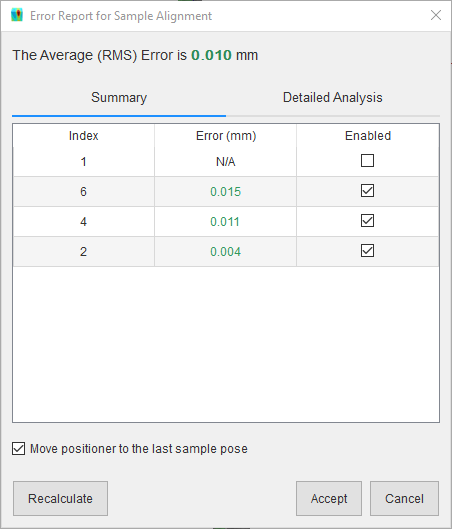
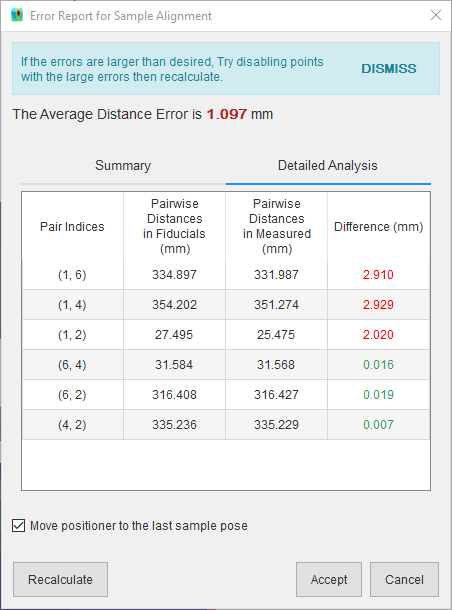
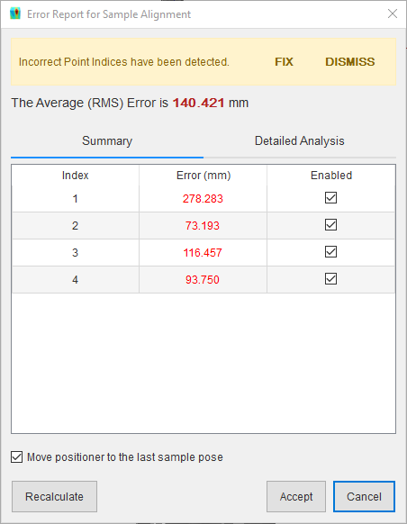

##########################
Align Sample on Instrument
##########################
Sample preparation is typically performed off the instrument after which the sample is moved to the instrument. SScanSS needs
to know the transformation (alignment matrix) from the original sample pose to the pose on the instrument. Once the alignment
matrix is specified, the sample model, fiducials, and measurements will be rendered in the instrument scene. The alignment
matrix can be specified in the following ways:

.. tip::
    An alignment matrix must be specified even if it is an identity matrix without which the simulation cannot
    be executed.

******************
Align with 6D pose
******************
The alignment matrix can be specified with 6 values: 3 (X, Y, Z) rotation angles and 3 (X, Y, Z) translation values. To
do this click **Instrument > Align Sample on Instrument > 6D Pose**, type in the values, and click **Align Sample**.

.. image:: images/align_with_6D_pose.png
   :scale: 80
   :alt: Align with 6D pose window
   :align: center

********************************
Align with transformation matrix
********************************
The alignment matrix can be specified directly by importing a :ref:`trans file`. To do this click
**Instrument > Align Sample on Instrument > Transformation Matrix**, select the file in the dialog and click
**Open**.

**************************
Align with fiducial points
**************************
A common method of determining the alignment matrix is to re-measure fiducial points (a minimum of 3 non-collinear
points is required) on the instrument and calculate the rigid transformation directly.

1. Write the re-measured fiducial points into a :ref:`fpos file`.
2. Click **Instrument > Align Sample on Instrument > Fiducial Points** on the main menu.
3. Select the :ref:`fpos file` from the file dialog and click **Open**.
4. The rigid transformation is calculated and an error report that shows the distance error between the
   transformed fiducial points and the measured points is displayed.

.. image:: images/alignment_report.png
   :scale: 80
   :alt: Alignment error dialog with good result
   :align: center

On the error report, if the accuracy is within tolerance, click the **Accept** button to place the sample on
the instrument using the matrix. If **Move positioner to the last sample pose** is checked, the positioning
system will be moved to the last pose in the :ref:`fpos file` (or to the positioning system's default pose if no poses
are specified), which could be useful for visual validation of the sample position.

If the accuracy in the error report is poor, try the following:

1. Disable the point with the largest error and click **Recalculate**.
2. Repeat previous step until accuracy is tolerable or only 3 non-collinear points are enabled.
3. Click the **Accept** button.

.. tip::
    Use more than 3 non-collinear points to get a better approximation of the alignment matrix.

If it is not clear from the summary which point is contributing to the large error, click the **Detailed Analysis**
tab to view a breakdown of the pairwise distances in the fiducial points, pairwise distances in the measured points,
and their absolute difference.

The software will also attempt to determine if the measured points in the :ref:`fpos file` are in the wrong order
and offer to fix them. Click the **Fix** button to correct the point order, then click **Accept** if accuracy is
tolerable. The correct order is determined by comparing the pairwise distances in the fiducial points with the
pairwise distances in the measured points. This algorithm relies on having unique distances in each point sets, if
the fiducial points were arranged, for example, in an equilateral triangle the algorithm will not be able to
determine the correct order since all the distances are similar.

***********************
Export alignment matrix
***********************
The alignment matrix can be exported from project file to a :ref:`trans file`. Click
**File > Export... > Alignment Matrix** in the main menu, navigate to the desired save location in the file dialog,
enter a name for the file and press the **Save** button.
