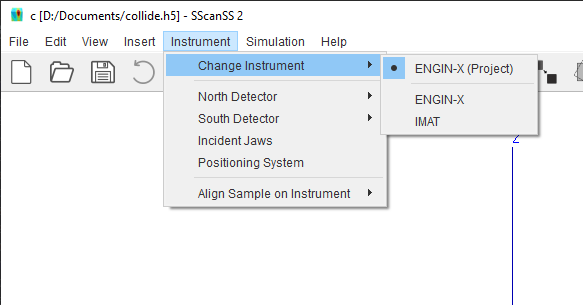
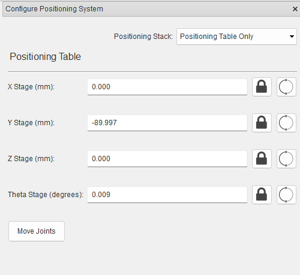

########################
Instrument Configuration
########################
Instruments are defined using :ref:`Instrument Description Files <instrument description file (idf)>` depending on the
instrument certain options might be available or unavailable. For example, you will not be able to change the position
of a detector from the settings, if the instrument is defined with fixed detector.

********************
Switching instrument
********************
After a new project is created for a specific instrument, it is possible to switch instruments, for example, to
measure the same sample and points at another instrument. To change the project instrument,
select **Instrument > Change Instrument** on the main menu and click the desired instrument from the submenu.

The instrument change cannot be undone so it is advisable to save the changes to the project before performing the
action, the software will warn the user if the project has unsaved changes. The sample, fiducial points, measurement
points and vectors will be preserved after the instrument change but all instrument specific settings such as the
selected collimator will be lost even if the new instrument uses a similar naming convention. When switching to
an instrument with smaller number of detectors than the active instrument, the extra measurement vectors will be added
as alignments.

When a project is saved, the instrument is also written into the save file, if the version of the instrument in the
project file differs from the version in the software, it is possible to switch from project version of the instrument
to the software version.

***************************
Positioning system settings
***************************
To change the positioning system settings, click **Instrument > Positioning System** on the main menu.

To change the positioning system, select a positioning system from the positioning stack drop-down.

To change the position, type in new joint variables and click the **Move Joints** button.

.. tip::
    You can lock individual joints by clicking |lock| button and ignore joint limits by clicking |limit| button.

*****************
Detector settings
*****************
To change the detector collimator, click **Instrument > (Detector Name)** and select desired collimator.

If the detector is movable, the joint offset can be changed by clicking **Instrument > (Detector Name) > Other settings**.

**********************
Incident Jaws settings
**********************
To manage incident jaws settings, Click **Instrument > Incident Jaws** from the menu.

.. image:: images/jaws.png
   :scale: 80
   :alt: Incident Jaws Windows
   :align: center

To change the incident jaws aperture, type in the horizontal and vertical aperture values, and click the
**Change Aperture Size** button.

If the jaws are movable, the jaws positioner settings will be available similar to `Positioning system settings`_ . To
change the position, type in the new joint variables, and click the **Move Jaws** button.

.. |lock| image:: images/lock.png
            :scale: 10

.. |limit| image:: images/limit.png
            :scale: 10
