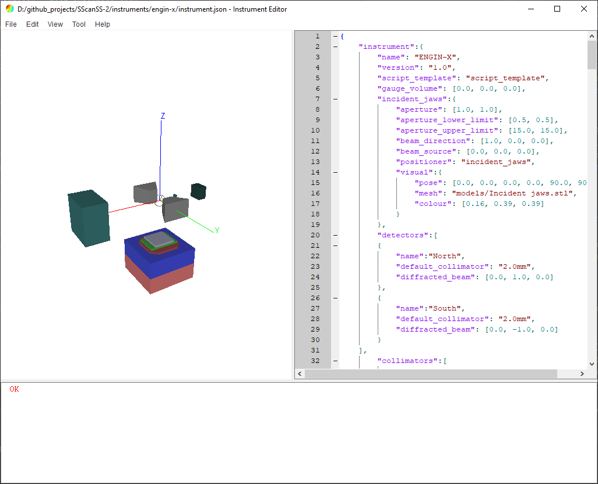
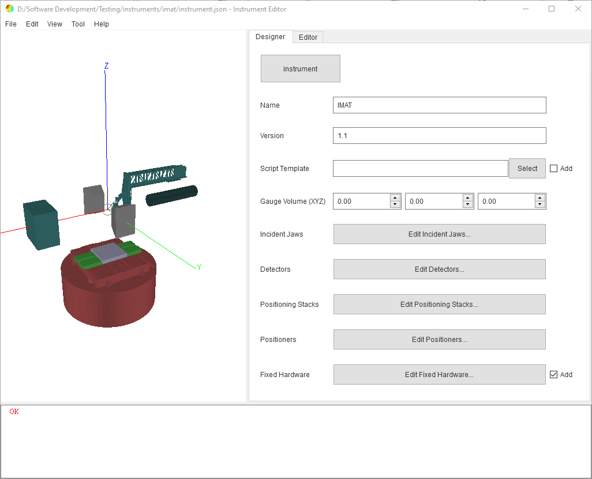
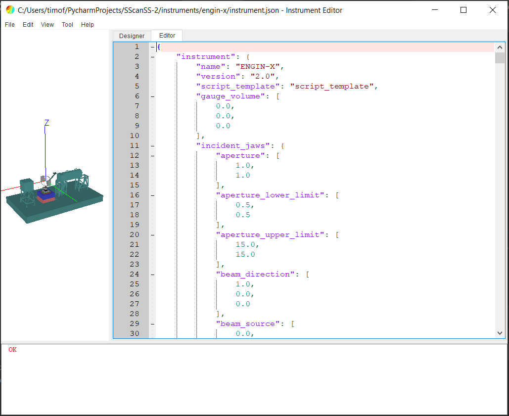
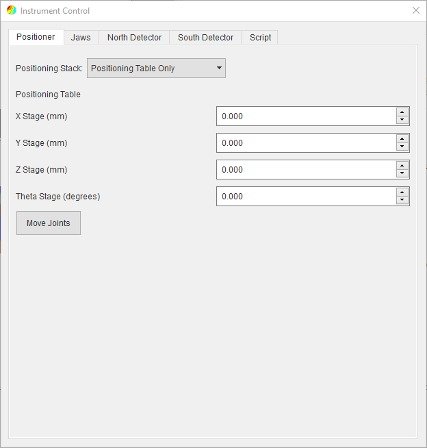

#################
Instrument Editor
#################

This is a tool for modifying instrument description files for SScanSS 2. The editor simplifies the creation and
modification of instrument description files by providing real-time validation against the instrument schema and
giving user friendly error messages to the developer. It will also validate that referenced files (3D model,
templates etc) exists.

************************
Graphical User Interface
************************
The user interface of the instrument editor consists of a menu bar on top and a main widget which is divided into three
regions. The main widget contains the graphics window on the left, the JSON editor on the right, and the message window
on the bottom. These regions are separated by splitters which allows adjustment of the size of the regions by dragging
the boundary between them.

Menu Bar
========
There are three menus on the menu bar:

==================      =============================================
Menu                    Description
==================      =============================================
File                    Create new, open and save instrument
                        description JSON file.
Edit                    Search for text within the editor json file.    
View                    Change camera view in the graphics window,
                        open instrument control, rest instrument and
                        hide/show the coordinate frame.
Tool                    Tool for generating description from positioner
                        measurements.
Help                    Offers on-line documentation for Editor and
                        instrument description API.
==================      =============================================

JSON Designer
=============

The JSON editor has two tabs to switch between ways to modify the file. The first tab is the designer which provides
nice gui to modify the instrument files. It starts at the top instrument object in the JSON file and to edit other
objects the user press the Edit buttons. The navigation bar on top returns to parent objects in the hierarchy.

JSON Text Editor
================

The other way to modify the file is the QScintilla-based text editor. It supports JSON highlighting, line numbers,
copy and paste etc.

The instrument description is validated in real-time as changes are made. The two modes are synced only when the correct
schema is entered, then the other widget will be updated to the newly entered JSON. The developer would also be prompted
to save if an attempt is made to close the editor without saving.

Graphic Window
==============
The graphics window is the same as the one used in SScanSS 2 (See :ref:`navigation <Navigation>`). It supports scene
rotation with the left mouse button, panning with the right mouse button and zooming with the mouse wheel.

Message Window
==============
The message window informs the developer if the instrument description is valid. The window will display JSON format
errors, instrument schema errors and others.

.. warning::
    An error will be thrown if a required keyword is missing but no error will be thrown if optional
    keywords are missing. Mis-spelling an optional keyword will not result in an error so it is important
    to double check optional keywords.

**************************
Controlling the Instrument
**************************
When an instrument description file is opened in the editor, the instrument will be loaded in the default state with
the first positioning stack, default collimator and jaws state. The state of the instrument can be changed from the
control dialog. The dialog can be opened by clicking **View > Instrument Control**

The control dialog contains the following tabs:

* **Positioner**

  The joints in the positioner can be moved and the positioning stack changed.

* **Jaws**

  The jaws position and the aperture size can be changed.

* **Detector**

  The detector position and the collimator model can be changed. There will be a tab for each detector

* **Script**

  A random set of joint positions for the active positioning stack would be rendered using the script template.

.. note::
   If the instrument description is invalid (i.e. message window has an error), the control dialog will not be
   populated with tabs or tabs will be removed if they were added already.

The instrument can be returned to the default state by clicking **View > Reset Instrument** or by pressing **F5** on the
keyboard.