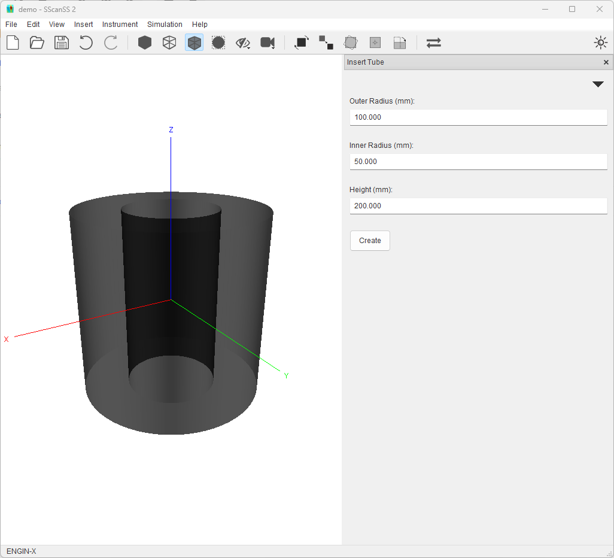
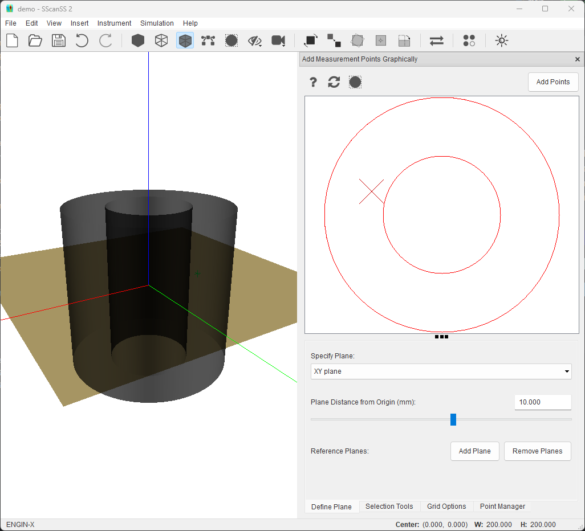
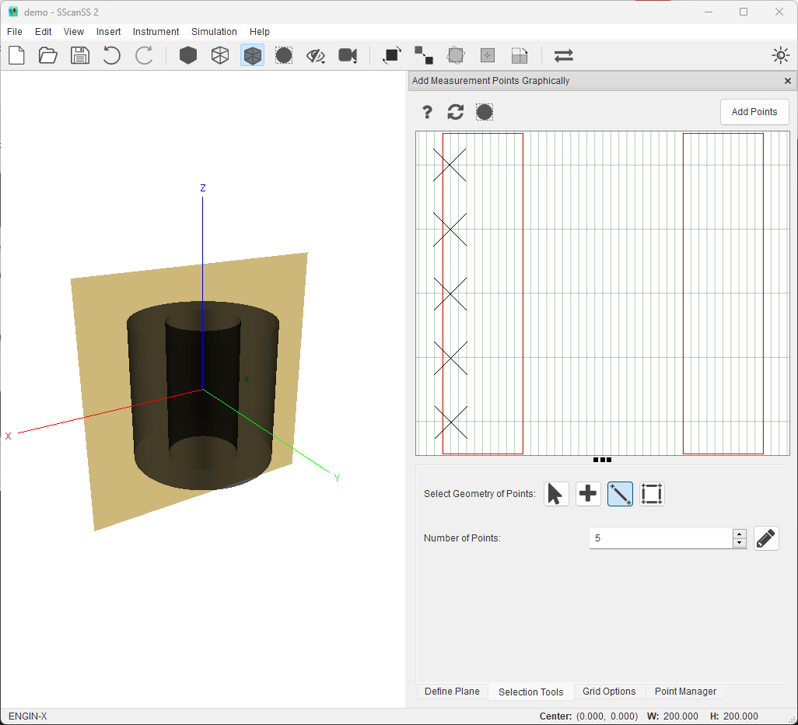
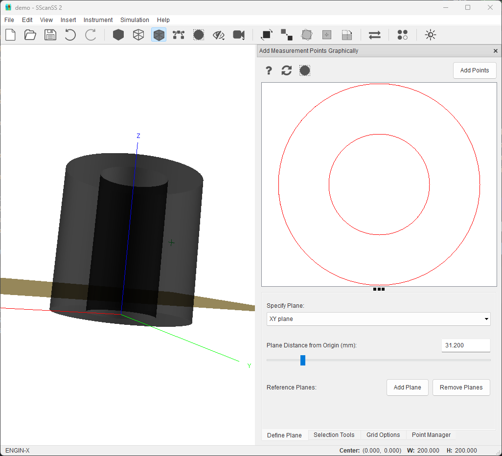

============================
Selecting Measurement Points
============================
This tutorial illustrates the tips and tricks of graphically selecting measurement points in the SScanSS 2 software.
This tutorial uses the ENGIN-X instrument but the steps shown should apply to other instruments.

We begin by creating a new project (**File > **New Project**). In the new project dialog, type in a project name, select
any instrument and click create.

***************
Create a Sample
***************
Add a tube sample to the project. Click **Insert > Primitives > Tube** then click the **Create** button in the Form.

**************************
Select a Measurement Point
**************************
Click the **Insert > Measurement Points > Graphical Selection**. Select the point tool in the **Selection Tools** tab,
and try to add a point at the position (-60, 20, 10) by clicking with the mouse cursor.

* Move the XY plane to 10 from the origin in the **Define Plane** tab.
* Move the mouse cursor to -60 in the X (horizontal) direction and 20 in the Y (vertical) direction. Use cursor
  location in the status bar.
* Click the left mouse button to add a measurement point to that location.
* Click the **Add Points** to save points before moving the plane otherwise unsaved points will be lost

While this is not the optimal use of the graphical selection tools (i.e the key-in method should be used if the coordinates
of measurement are already known), this should typically be used if you need to add a group of points (i.e using the line or
area tool) with known start and/or end positions.

*************************
Add Equally Spaced Points
*************************
A more typical usage of the graphical selection tools would be to add a group of points at a desired distance from an
in-plane surface. For example, we could try to add five (5) points on a line 5mm from the outer surface of the tube
sample. While it possible to use the mouse cursor trick described above, SScanSS provides better tools for this operation

* Select the XZ plane from the dropdown in the **Define Plane** tab.
* Click the **Show Grid** option in the **Grid Options** tab. Specify a 5 x 40 grid as the grid size.
* Select the line tool in the the **Selection Tools** tab, Specify 5 as number of points.
* Clicking on the top-left most grid intersection inside the sample and dragging to the bottom-left will add 5 equally
  spaced points 5mm from tube wall

.. tip:: Select the **Snap Selection to Grid** option in the **Grid Options** tab to make the mouse cursor
        snap to the nearest grid intersection.

***********************
Precise Plane Placement
***********************
The position of the plane in the graphic selection is always with respect to the origin of the coordinate system. This
coordinate system would typically be the same as the scanning equipment that produced the model. In a situation, where
the features to be measured are at known distances from a reference surface, it might be beneficial to move the origin
to the reference surface. This could be easily achieved by using the :ref:`transformation tools <Transform Sample>`

For example, if the desired measurement plane is known to be 31.20mm from the bottom cap of the tube sample. For this
example, the :ref:`move origin tool <Move origin to sample>` can be used

* Click the |origin| button in the toolbar
* In the **Move To** dropdown, select the Bound Minimum or Maximum option
* In the **Ignore Axis** dropdown, select XY since we only want to move the axis in the Z axis
* Reopen the graphic selection widget and Move the XY plane to 13.20 from the origin in the **Define Plane** tab.

In a more complex situation where the surface of interest does not align with the X, Y, or Z axis, the
:ref:`plane alignment rotation tool <Rotate sample by plane alignment>` can be used to align the surface with the two of
the principal axes then the move origin tool can be used as described above

.. |origin| image:: images/origin.png
            :scale: 10

