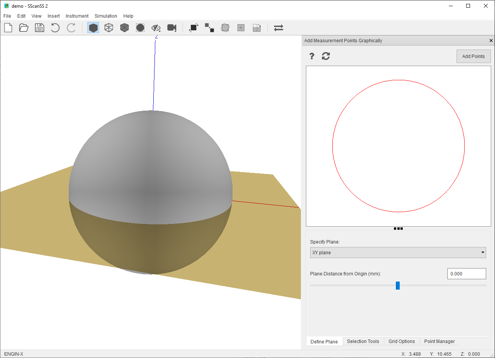

#########################
Insert Measurement Points
#########################
Measurement points may be imported from a file, typed in, or selected graphically. The measurement points are
rendered as stars in the graphics window.

************************************
Loading measurement points from file
************************************
To import a :ref:`measurement file`, Go to **Insert > Measurement Points > File...**, browse to the location of the file and
select it.

*************************
Key-in measurement points
*************************
Click **Insert > Measurement Points > Key-In** and  type in the X, Y, and Z values of the measurement points and click **Add Fiducial Point**
button. The measurement point should be displayed in the graphics window

.. image:: images/add_measurements.png
   :scale: 80
   :alt: Key-in Fiducials Window
   :align: center

****************************************
Graphical selection of measurement point
****************************************
To graphically add measurement point, click **Insert > Measurement Points > Graphical Selection**.

* Adjust plane direction and distance from origin to change cross-section.
* Click the **Selection Tools** tab, and click on the |point| tool.
* Click on the cross-section graphics window to specify point locations.
* Click **Add Points** to selected points to project.

To delete point:

* Click the **Selection Tools** tab, and click on the |select| tool.
* Select the points on cross-section graphics window and press the delete key.

*************************
Manage measurement points
*************************
Measurement points can be viewed and managed via the point manager. The point manager will be opened when measurement points are
added, if the point manager is closed it can be opened by selecting **View > Other Windows > Measurement Points** in the menu.
Operations for measurement points are similar to :ref:`manage fiducial`.

.. |point| image:: images/point.png
            :scale: 10

.. |select| image:: images/select.png
            :scale: 10