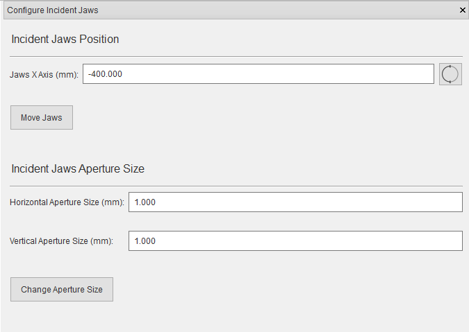

########################
Instrument Configuration
########################
Instruments are defined using **Instrument Description Files** depending on the instrument certain options might be
available or unavailable. For example, you will not be able to change the position of a detector (in the settings),
if the instrument is defined with fixed detector.

***************************
Positioning system settings
***************************
To change the positioning system settings, click **Instrument > Positioning System**.

.. image:: images/positioners.png
   :scale: 80
   :alt: Incident Jaws Windows
   :align: center

To change the positioning system, select a positioning system from the positioning stack drop-down.

To change the position, type in new joint variables and click the **Move Joints** button.

.. tip::
    You can lock individual joints by clicking |lock| button and ignore joint limits by clicking |limit| button.

*****************
Detector settings
*****************
To change the detector collimator, click **Instrument > (Detector Name)** and select desired collimator.

If the detector is movable, the joint offset can be changed by clicking **Instrument > (Detector Name) > Other settings**.

**********************
Incident Jaws settings
**********************
To manage incident jaws settings, Click **Instrument > Incident Jaws** from the menu.

To change the incident jaws aperture, type in the horizontal and vertical aperture values, and click the
**Change Aperture Size** button.

If the jaws are movable, the jaws positioner settings will be available similar to `Positioning system settings`_ . To
change the position, type in the new joint variables, and click the **Move Jaws** button.

.. |lock| image:: images/lock.png
            :scale: 10

.. |limit| image:: images/limit.png
            :scale: 10
