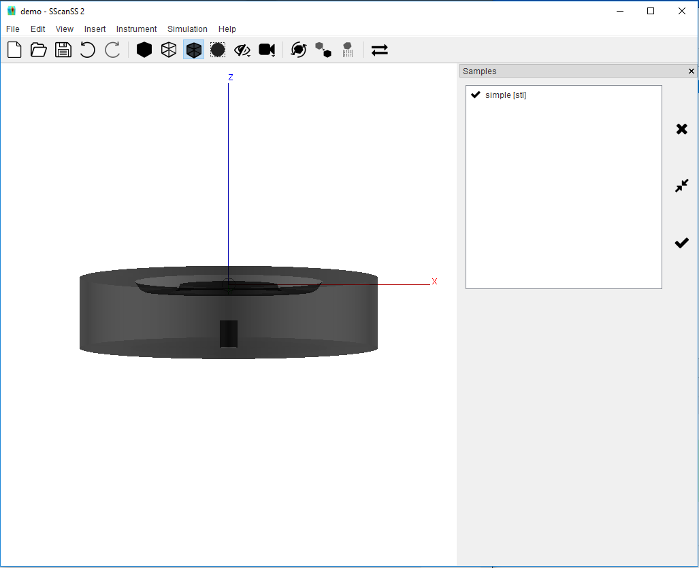
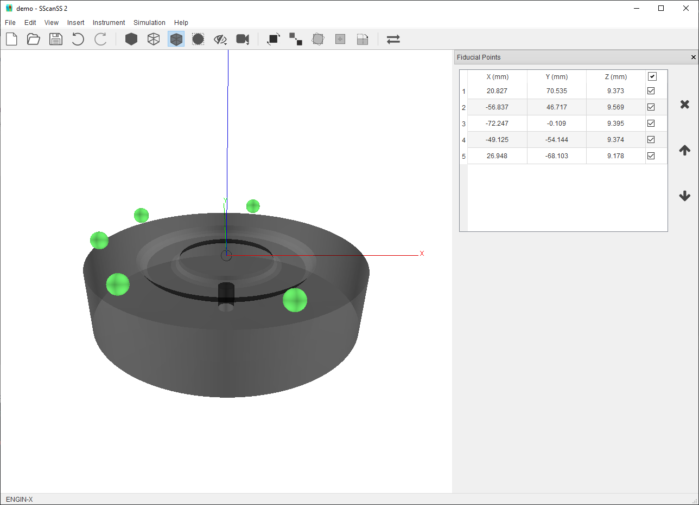
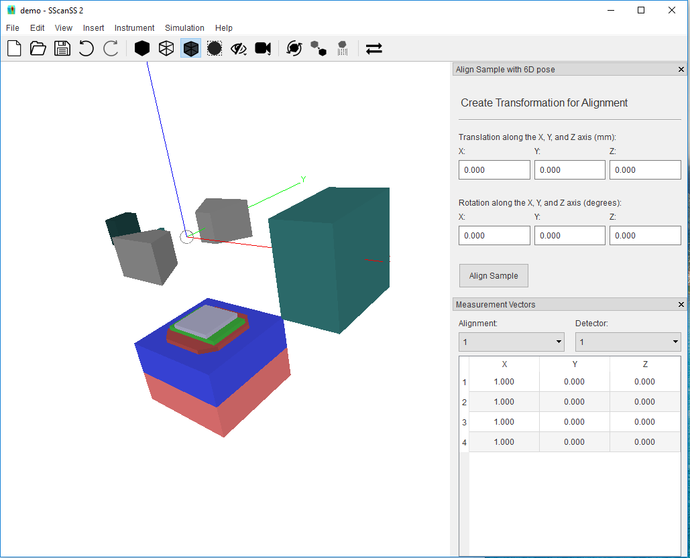
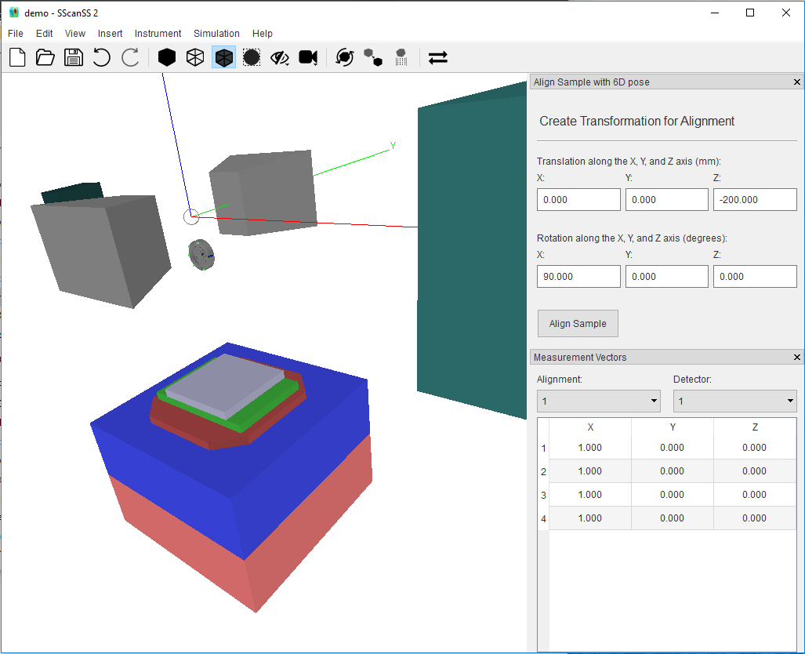
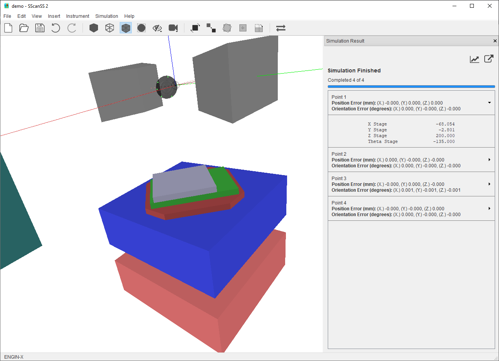

=============
Example Usage
=============
This tutorial illustrates the basic ideas behind the SScanSS-2 software. The files used in this tutorial can be
downloaded from the SScanSS-2 |release| page on github. Download and extract **data.zip** from the release's **assets**.
This tutorial uses the ENGIN-X instrument but the techniques shown should apply to other instruments.

We begin by creating a new project, click **File**, and then click **New Project**. You will see the new project dialog.
Type in a project name, select ENGIN-X as the instrument and the click create.

.. image:: images/start.png
   :scale: 50
   :alt: New Project Dialog
   :align: center

*********************
Setting up the Sample
*********************

1. Click **Insert > Sample > File** and browse to the location of the data folder and select **simple.stl**.
You will see the sample model in the graphics window.

2. Click **Insert > Fiducial Points > File** and browse to the location of the data folder and select
**simple.fiducial**. You will see the green spheres added in the graphics window.

3. Click **Insert > Measurement Points > File** and browse to the location of the data folder and select
**simple.measurement**. You will see the green crosses added in the graphics window.

.. image:: images/insert_measurement.png
   :scale: 50
   :alt: Insert Measurement Points
   :align: center

3. Click **Insert > Measurement Vectors > Select Strain Component** the select stain component "Parallel to X Axis".
Click **Add Measurement Vectors** and in the graphics window, you will see the blue line segments drawn from the measurement point along the
X Axis.

.. image:: images/insert_vector.png
   :scale: 50
   :alt: Insert Measurement Vectors
   :align: center

*****************
Simulating a Scan
*****************

1. Before we can simulate, the sample must be aligned on the instrument. To do this, go to
**Instrument > Align Sample on Instrument > 6D Pose**, you will see a new dialog and the model of the
instrument in the graphics window.

2. Specify a Z Axis translation of -200 and X Axis Rotation of 90. Click Align Sample, you see the
sample model, fiducials, measurement points and vector

3. Start a new simulation by clicking **Simulation > Run Simulation** or the **F5** key. You will see the instrument
move the sample into the appropriate position and orientation for each measurement and the result displayed in a
dialog

4. Finally the result script can be exported by clicking **File > Export > Script** and then click **Export** on the
dialog.

.. |release| raw:: html

   <a href="https://github.com/ISISNeutronMuon/SScanSS-2/releases/" target="_blank">release</a>
