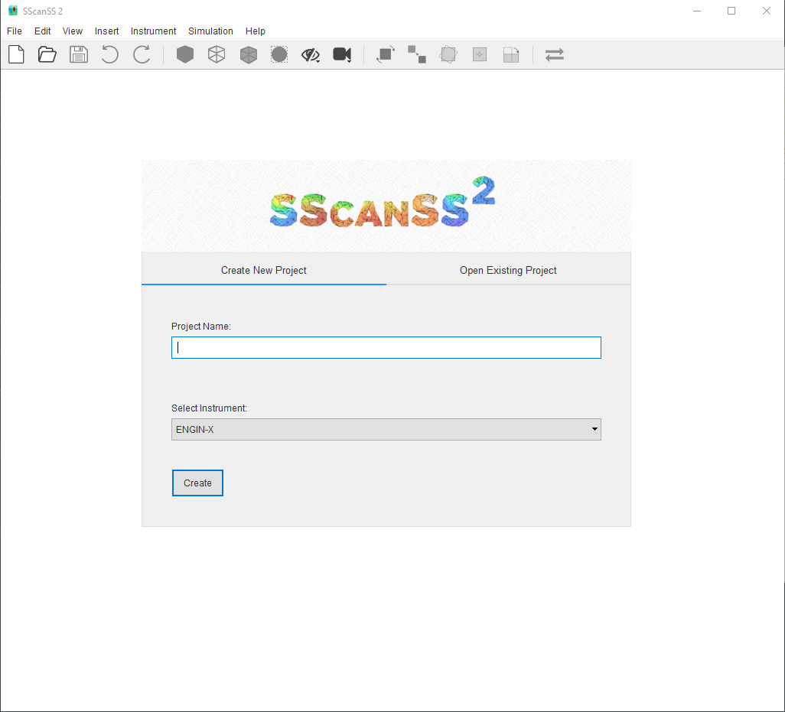
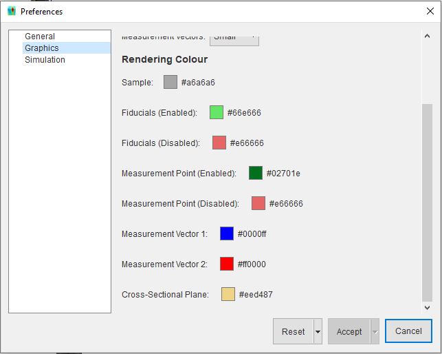

################
General Overview
################
After starting SScanSS-2, the new project dialog will be opened because SScanSS-2 cannot be used without an instrument.
To close the new project dialog without creating a new project, press the **Esc** key. When no project exists, several
actions will be disabled.

******************
Create new project
******************
The new project dialog can be opened using the shortcut **Ctrl + N** or by clicking  **File > New Project**.

.. tip:: You can also click the |new| icon on the toolbar.

To create a new project:

1. Type in the name of the project
2. Select the Instrument for the project
3. Click the *Create* button

The new project dialog will close as soon as the project is created.

************
Open project
************
Project files are written using the |hdf| file format with a **.h5**
extension. The project files stores all the information required for the simulation including the instrument
description.

To open an existing project:

1. Press **Ctrl + O** or click **File > Open Project**.

.. tip:: You can also click the |open| icon on the toolbar.

2. Locate the file in the file dialog and click open.

Open recent project
===================
To open recent project (last 10), Click **File > Open Recent** and click the desired file. Existing and recent project
can also be opened from the new project dialog.

1. Click the **Open Existing Project** tab.
2. Double-click on a recent file or double-click **Open ...** to show file dialog.

.. image:: images/open_existing.png
   :scale: 80
   :alt: Open Existing Project
   :align: center

************
Save project
************
To save a project:

1. Press **Ctrl + S** or click **File > Save Project**.

.. tip:: You can also click the |save| icon on the toolbar.

2. You must enter a name for the file if you are saving it for the first time.

Save with a different name
==========================
To save a project with a different name, click **File > Save As...***, type in the file name, and
click save.

******************
Change preferences
******************
The Preferences contains settings to control the behaviour of SScanSS 2. The preference dialog can be opened using
the shortcut **Ctrl + Shift + P** or by clicking  **Edit > Preferences**.

The preferences dialog divides the setting into two sections: Graphics and Simulation.

* The graphics section allows the colour and sizes of most rendered object can be changed, all the graphics settings are self-explanatory.
* The simulation section allows the changes to simulation accuracy, order etc. each setting is explained here.....

.. note:: Preferences are system wide therefore any simulation and graphics setting change will be applied to
   subsequent projects until someone else changes them.

Clicking **Accept** will save the changes while clicking **Cancel** will close the dialog without saving.
The **Reset to Default** returns all settings to their default values.

.. warning:: Preferences are not saved with the project so you must remember any simulation settings that were
   important to your experiment. This behaviour is inconvenient and will be changed in the next update.

*************
Undo and Redo
*************
SScanSS-2 is designed so that most operations that affects the project data can be undone. You can undo and redo
an action using the shortcut **Ctrl + Z** and **Ctrl + Y** respectively. The undo history can be viewed by
clicking **Edit > Undo History**.

.. tip:: You can undo |undo| or redo |redo| actions from the toolbar. Also from the menu by clicking **Edit > Undo**
   or **Edit > Redo**

The following operations cannot be undone:

* Visualization actions (e.g. changing the camera view),
* Preference changes,
* Running a Simulation,
* Switching to a different instrument.

.. |undo| image:: images/undo.png
            :scale: 10

.. |redo| image:: images/redo.png
            :scale: 10

.. |save| image:: images/save.png
            :scale: 10
            :alt: Save

.. |open| image:: images/folder-open.png
            :scale: 10
            :alt: Open

.. |new| image:: images/file.png
            :scale: 10
            :alt: New Project

.. |hdf| raw:: html

   <a href="https://www.hdfgroup.org/solutions/hdf5/" target="_blank">hdf5</a>
