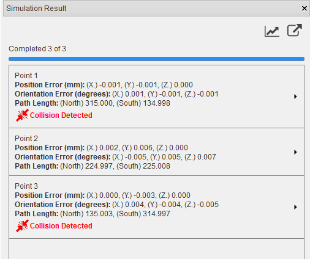

######################
Simulating Experiments
######################
The main goal of SScanSS is to compute positioner offsets for the real-world experiment. This can be achieved by running
a simulation: to run a simulation, click  **Simulation > Run Simulation** and to stop the simulation **Simulation > Stop Simulation**.

.. tip::
   You can start and stop a simulation using keyboard shortcuts **F5** and **Shift+F5** respectively

The **Simulation Result** window should open shortly after the simulation is started and the results will be added to the
window to the end of the list. The progress bar shows the number of measurements that have been completed. The
**Simulation Result** window cannot be closed while the simulation is running, stop the simulation if you need to close
the dialog.

.. note::
    You might experience a slight lag between starting a simulation and the opening of the **Simulation Result** window
    while this is not a serious issue it is a known problem.

After closing the window, you can view and export completed results without re-running the simulation by opening
the **Simulation Result** window, to do this click **View > Other Windows > Simulation Results**.

.. image:: images/sim_result_expand.png
   :scale: 80
   :alt: Simulation Result Expanded
   :align: center

The result for each measurement point and alignment can be seen in the result list. The result show the
point index and alignment index (where applicable), the 3D position and orientation error. The result will also show path
length, and collision information when they are enabled in the :ref:`quick settings`.
Clicking on the label for a single result will reveal the computed positioner offset which could be useful for quick
verification, these offsets can be copied to the operating system clipboard by right clicking on the label and selecting
**copy**. When the simulation is complete, individual result can be visualized by right clicking on the label and selecting
**visualize**.

.. image:: images/sim_result_context.png
   :scale: 80
   :alt: Simulation Result Context Menu
   :align: center

The simulation may not achieve the desired positional or orientational accuracy because of joint limits, insufficient
degrees of freedom, or software's failure to converge. The label for such results will be highlighted in yellow and the
poor accuracy will be written in red text. If the poor accuracy is due to software's failure to converge,
try modifying the :ref:`advanced options` to improve convergence.

.. image:: images/sim_result_errors.png
   :scale: 80
   :alt: Simulation Result Error
   :align: center

**************
Quick settings
**************
The **Simulation** menu has a few quick settings which can be applied to each simulation run. Changing the quick settings
will not affect an active simulation, the simulation needs to be restarted for the setting to take effect.

Visualization
=============
Visualization is enabled for simulations by default, it can be toggled by clicking **Simulation > Show Graphically**.
Disabling visualization will increase the speed of the simulation while not significant for a small number of measurements,
simulations with 100 or more measurements may benefit from the speed increase if visualizing the sample position is unimportant.

Hardware limit
==============
During simulation, positioning system limits are checked by default, this can be toggled by clicking **Simulation > Hardware Limits Check**
When disabled, all the joint limits on the positioning system are ignored (to ignore limit on a single joint see Positioning System).
When enabled, any joint limits that are not explicitly disabled in the positioning system window will be checked.

Collision detection
===================
Collision detection is disabled by default, it can be toggled by clicking **Simulation > Collision Detection**.
When activated, SScanSS-2 will check for collisions at the final sample pose of each measurement and highlight the
colliding bodies in the graphic window (if **Show Graphically** is enabled). The simulation results will also indicate
the point and alignment at which the collision occurred.

.. warning::
    Even though the collision detection in SScanSS-2 is reasonably robust, it should not be a substitute for your eyes
    but a complement. The following should be taken into account:

    1. The software cannot check collisions for objects that are not present such as sample holders, or incomplete models
       of the sample or instrument.
    2. The software only checks for collisions at the final sample pose of a measurement but the path to the pose is not
       checked. It is very possible that the object can collide on its way to the final pose.
    3. Instrument 3D model could differ from real-world because it is a simplification or out of date.

Path length calculation
=======================
Path length calculation is disabled by default, it can be toggled by clicking **Simulation > Compute Path Length**.
Path lengths are calculated by checking the distance the beam travels within the
:ref:`main sample model <Change main sample>` (other samples would be ignored). It assumes that the beam starts outside
the sample and every pair of face intersections is taken as beam entry and exit from the sample. The path length is set
to zero if beam hits the gauge volume outside the sample or an entry/exit face pair is not found.

.. warning::
    The path length might be incorrect if the sample has missing faces or spurious faces due to poor scanning
    that intersect with the beam.

The computed path lengths for each measurement will be written into the simulation results and a plot of the path
lengths for each alignment group can be viewed by clicking the plot |plot| button in the **Simulation Result** window.

*************
Export script
*************
After the simulation is completed, the generated scripts can be exported by clicking **File > Export > Script** or by
clicking the export |export| button on the **Simulation Result** window. The **Export Script** dialog wil open, specify
the microamps for the experiment if necessary, and click the export button. The dialog also shows a preview of the
script (only a maximum of 10 results are shown in the preview).

.. image:: images/script.png
   :scale: 50
   :alt: Script Export Dialog
   :align: center

****************
Advanced options
****************
More advanced option for simulation can be accessed by clicking **Simulation > Simulation Options**. The following
options can be changed from the dialog:

.. note::
   SScanSS-2 uses global optimization technique to solve the inverse kinematics problem for each measurement. The
   optimization is a two-phase method that combines a global stepping algorithm with local minimization at each step.

* **Execution Order**

  When a project contains more than one measurement vector alignment, experiments can be run by measuring each point
  before changing the alignment (*Run next point before alignments*) or by measuring each alignment before moving to
  the next point (*Run alignments before next point*).
* **Position termination tolerance**

  The desired position accuracy which when achieved the positional part of the inverse kinematics is considered successful
* **Orientation termination tolerance**

  The desired orientation accuracy which when achieved the orientational part of the inverse kinematics is considered successful
* **Number of evaluations for global optimization**

  The maximum number of evaluations of the inverse kinematics objective function by the global optimizer
* **Number of evaluations for local optimization**

  The maximum number of evaluations of the inverse kinematics objective function by the local optimizer

.. |export| image:: images/export.png
            :scale: 10

.. |plot| image:: images/plot.png
            :scale: 10